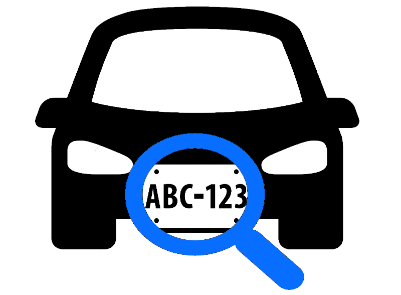
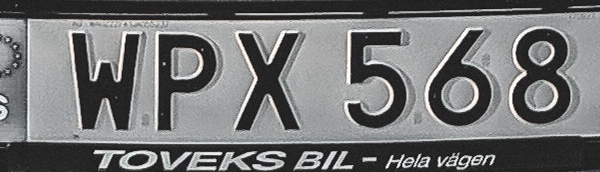
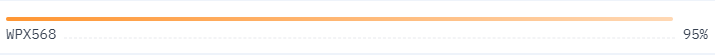

#### License Plate Reader
Identifies the license plate, cuts and displays it, and converts it into text.  
An image with higher resolution and clearer license plate will have a better accuracy. 
[Trained on european car plates]

#### Requirements:
* [NumPy](http://www.numpy.org/)
* [OpenCV](https://docs.opencv.org/4.x/)
* [Matplotlib](http://matplotlib.org/)
* [PaddleOCR](https://github.com/PaddlePaddle/PaddleOCR)

#### This project was made using YOLOv3

#### Example:
Input:
 

Output:
 

Confidence Score:
 

### [[DEMO]](https://huggingface.co/spaces/georgescutelnicu/license-plate-reader)
